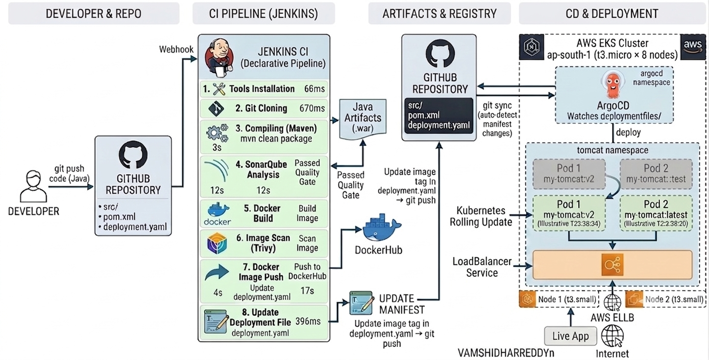
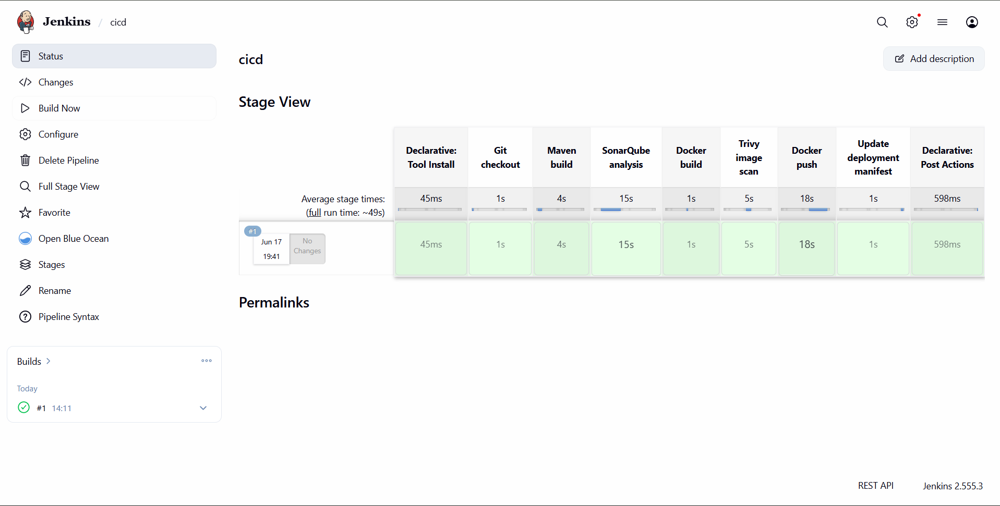
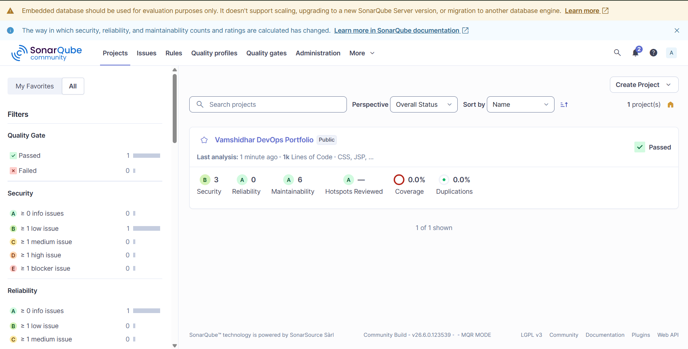
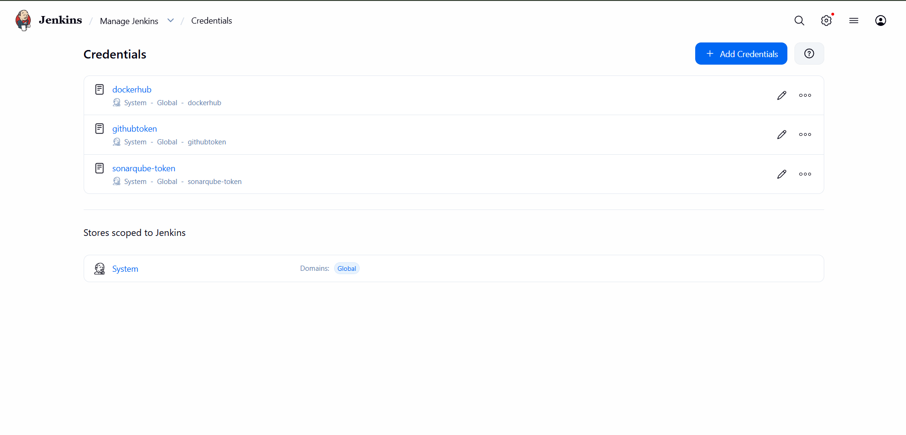
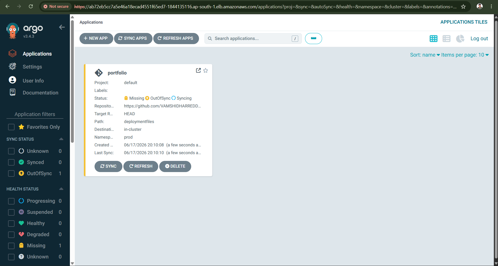
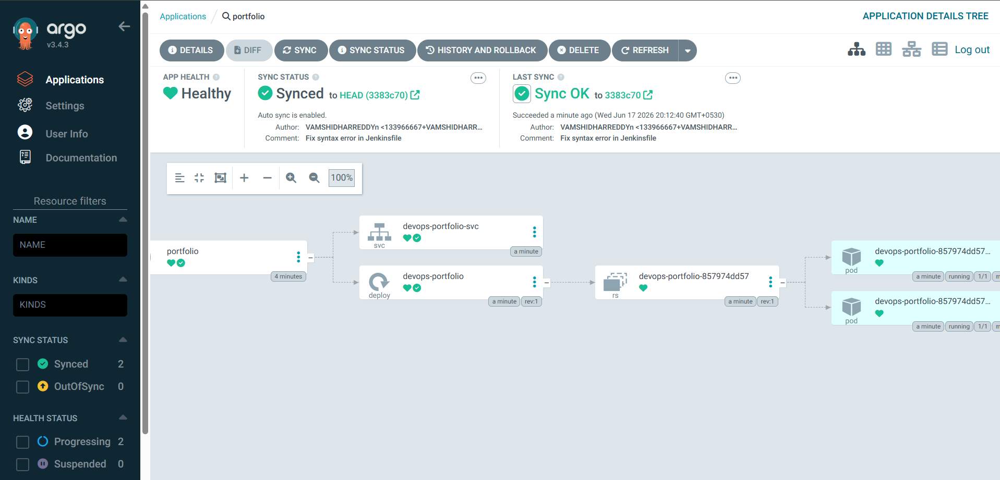
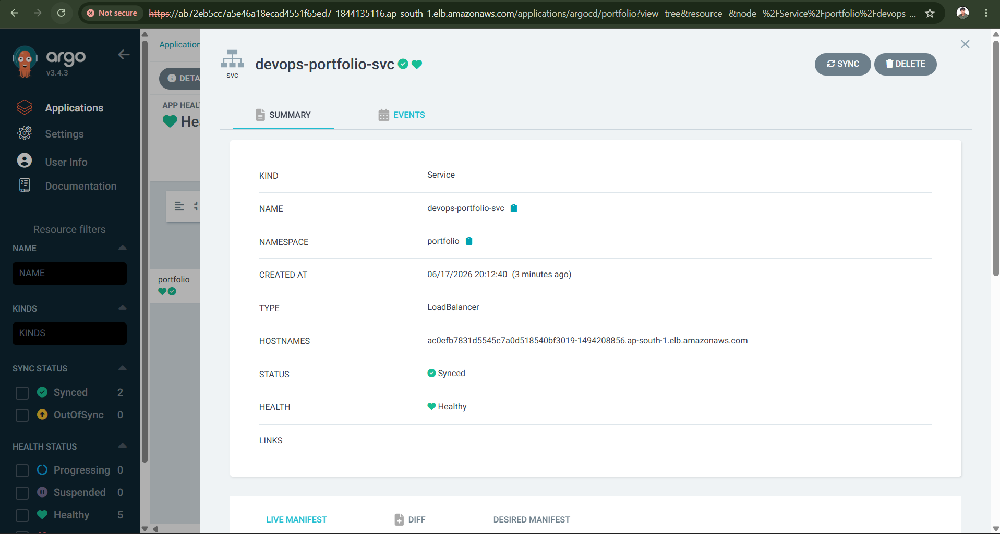
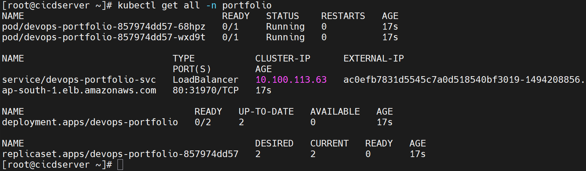
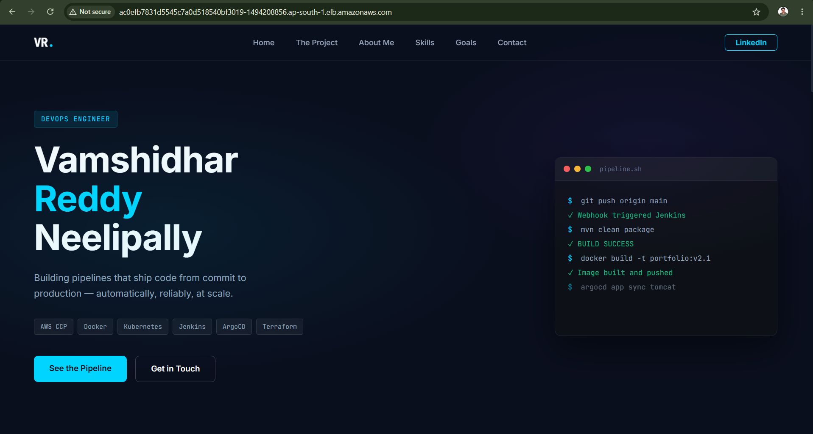
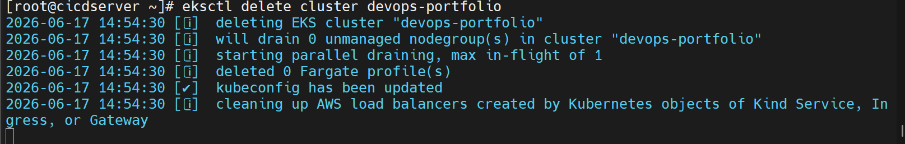

# DevOps Portfolio — Full-Scale CI/CD Pipeline

Full-scale CI/CD pipeline — Java app built with Maven, scanned with SonarQube and Trivy, containerized with Docker, and deployed to Kubernetes on EKS via ArgoCD GitOps automation.


# DevOps Portfolio — Full-Scale CI/CD Pipeline

> End-to-end CI/CD pipeline: Java web app built with Maven, quality-gated with SonarQube, security-scanned with Trivy, containerized with Docker, and deployed to AWS EKS via ArgoCD GitOps — fully automated from `git push` to live application. **Total pipeline runtime: ~49 seconds. Zero manual steps. Zero downtime.**



---

## Live Evidence

| What | Proof |
|---|---|
| Jenkins all stages green | [jenkins-pipeline.png] |
| SonarQube Quality Gate **Passed** | Security B · Reliability A · Maintainability A |
| ArgoCD **Healthy + Synced** | 2 pods running across separate EKS nodes |
| App live on AWS Load Balancer | ELB URL → portfolio website served |
| Cluster deleted after session | `eksctl delete cluster devops-portfolio` |

---

## Pipeline Flow

```
Developer  →  git push
                │
                ▼
          GitHub Repository
                │   webhook trigger
                ▼
          Jenkins CI  (Build #1 — 49s total)
                │
                ├── 1. Git checkout          (1s)
                ├── 2. Maven build           (4s)   mvn clean install
                ├── 3. SonarQube analysis    (15s)  Quality Gate enforced — fails if not passed
                ├── 4. Docker build          (1s)   tagged with BUILD_NUMBER
                ├── 5. Trivy image scan      (5s)   fails on HIGH/CRITICAL CVEs
                ├── 6. Docker push           (18s)  BUILD_NUMBER tag + latest → DockerHub
                └── 7. Update manifest       (1s)   sed image tag → git push → GitHub
                              │
                              ▼
                        ArgoCD detects deployment.yaml change (auto-sync)
                              │
                              ▼
                        Kubernetes rolling update on EKS
                        maxSurge: 1  |  maxUnavailable: 0
                              │
                              ▼
                        2 pods Running across separate nodes (ap-south-1)
                              │
                              ▼
                        Live app via AWS LoadBalancer
```

---

## Screenshots

### Jenkins Pipeline — All 7 Stages Passing (~49s total)


### SonarQube — Quality Gate Passed


### Jenkins Credentials Manager — No Hardcoded Secrets


### ArgoCD — Syncing (Progressing State)


### ArgoCD — Healthy + Synced (Final State)


### ArgoCD Service — LoadBalancer Healthy


### EKS Nodes — 8 Nodes Ready (Kubernetes v1.34.8)


### Pods Running in Portfolio Namespace


### Live Application on AWS Load Balancer


### Cluster Deleted After Session (Cost Management)


---

## Tech Stack

| Layer | Tool | Version | Purpose |
|---|---|---|---|
| Source control | GitHub | — | Code repo + webhook trigger |
| CI engine | Jenkins | 2.555.3 | Pipeline orchestration |
| Build | Maven | — | Java WAR compilation |
| Code quality | SonarQube | Community v26.6.0 | Static analysis + Quality Gate |
| Security scan | Trivy | — | Container image CVE scanning |
| Containerization | Docker | — | Image build + DockerHub push |
| GitOps CD | ArgoCD | 3.4.3 | Manifest sync → EKS |
| Orchestration | Kubernetes | 1.34.8-eks | Deployments, rolling updates, probes |
| Cloud | AWS EKS | — | Managed Kubernetes (ap-south-1) |

---

## Infrastructure

| Server | Instance | Purpose |
|---|---|---|
| Jenkins + SonarQube | t3.medium | CI pipeline execution + code analysis |
| EKS Nodes | t3.small × 2 (active) | Kubernetes workloads |

> **Cost note:** EKS cluster runs only during active sessions and is deleted via `eksctl delete cluster` to avoid charges. All screenshots were taken during a live session.

---

## Project Structure

```
devops-portfolio/
├── src/
│   └── main/
│       ├── java/com/vamshidhar/portfolio/
│       │   └── ContactServlet.java      # Java servlet — handles contact form POST
│       └── webapp/
│           ├── WEB-INF/web.xml
│           ├── css/style.css
│           ├── js/main.js
│           ├── index.jsp                # Portfolio landing page
│           └── thankyou.jsp
├── deploymentfiles/
│   ├── deployment.yaml                  # Kubernetes Deployment (ArgoCD watches this)
│   └── service.yaml                     # LoadBalancer Service
├── screenshots/                         # Live evidence from actual deployment
├── Dockerfile                           # Tomcat 10.1 / JDK 21 image
├── Jenkinsfile                          # 7-stage CI/CD pipeline
└── pom.xml                              # Maven build (Java 11, WAR packaging)
```

---

## Key Design Decisions

**Why separate Jenkins (CI) and ArgoCD (CD)?**
Jenkins handles build, test, scan, and push. ArgoCD owns cluster state. This means Git is always the single source of truth — if Jenkins goes down, the cluster stays synced. If someone manually changes a pod, ArgoCD self-heals it back to the declared state. This is the GitOps principle: cluster state is *declared* in Git, not *imperative* from a script.

**Why `BUILD_NUMBER` as the Docker tag?**
Every build produces a unique, traceable image. Rollback is one line: change the tag in `deployment.yaml`, push to GitHub, ArgoCD resyncs automatically. Using only `latest` makes rollback impossible and breaks traceability.

**Why Trivy with `--exit-code 1 --severity HIGH,CRITICAL`?**
A scan that doesn't gate the pipeline is security theatre. Setting `--exit-code 1` means HIGH or CRITICAL CVEs block deployment completely. Nothing reaches EKS if the image is compromised.

**Why `maxUnavailable: 0` in rolling update?**
The old pod stays alive and serving traffic until the new pod passes its readiness probe. Zero downtime on every deployment — even if the new image fails health checks, the rollout pauses and traffic stays on the healthy pod.

**Why Tomcat 10.1 / JDK 21?**
Upgraded from Tomcat 9 / JDK 11. Tomcat 10.1 is the current LTS release with Jakarta EE 10 support. The Dockerfile also runs `apt-get upgrade` to patch OS-level vulnerabilities before building.

**Why namespace `portfolio` instead of `default`?**
`default` namespace mixes all resources with no isolation. A dedicated namespace enables RBAC scoping, resource quotas, and cleaner `kubectl` filtering — and maps cleanly to how ArgoCD manages application boundaries.

---

## Security Practices

| Practice | Implementation |
|---|---|
| No hardcoded secrets | All credentials in Jenkins Credentials Manager (dockerhub, githubtoken, sonarqube-token) |
| Docker login secured | `--password-stdin` — password never passed as CLI argument |
| Build-time CVE gate | Trivy blocks deployment on HIGH/CRITICAL with `--exit-code 1` |
| OS patching in image | `apt-get upgrade` in Dockerfile patches base image vulnerabilities |
| Health gates before traffic | Readiness probe holds traffic until app fully starts |
| Namespace isolation | All resources scoped to `portfolio` namespace |
| SonarQube token rotation | Uses `-Dsonar.token` (not deprecated `-Dsonar.login`) |

---

## Kubernetes Manifests

```yaml
# deployment.yaml — key settings
spec:
  replicas: 2
  strategy:
    type: RollingUpdate
    rollingUpdate:
      maxSurge: 1          # One extra pod during update
      maxUnavailable: 0    # Zero pods down until new pod is ready

  containers:
    - image: vamshi82/devops-portfolio:BUILD_NUMBER
      livenessProbe:
        httpGet: { path: /, port: 8080 }
        initialDelaySeconds: 60
        periodSeconds: 10
      readinessProbe:
        httpGet: { path: /, port: 8080 }
        initialDelaySeconds: 60
        periodSeconds: 10
```

```yaml
# service.yaml
spec:
  type: LoadBalancer     # AWS ELB provisioned automatically
  ports:
    - port: 80
      targetPort: 8080
```

---

## How to Run Locally

```bash
# Clone
git clone https://github.com/VAMSHIDHARREDDYn/devops-portfolio.git
cd devops-portfolio

# Build WAR
mvn clean install

# Build Docker image
docker build -t devops-portfolio:local .

# Run
docker run -p 8080:8080 devops-portfolio:local

# Open http://localhost:8080
```

---

## Author

**Vamshidhar Reddy Neelipally**
AWS Certified Cloud Practitioner | DevOps & Cloud Engineer | KL University — CGPA 8.98

[](https://linkedin.com/in/n-vamshidhar-reddy)
[](https://hub.docker.com/u/vamshi82)
[](https://github.com/VAMSHIDHARREDDYn)
